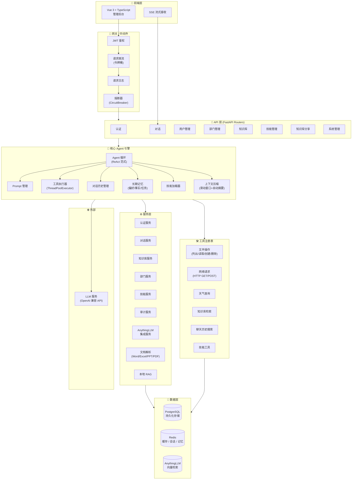
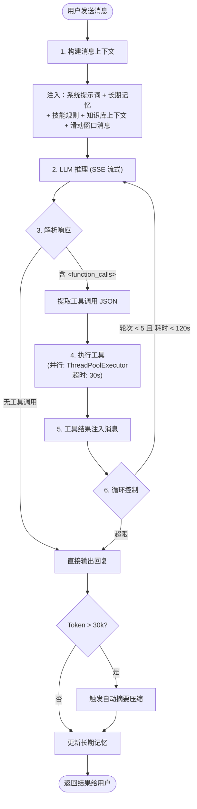
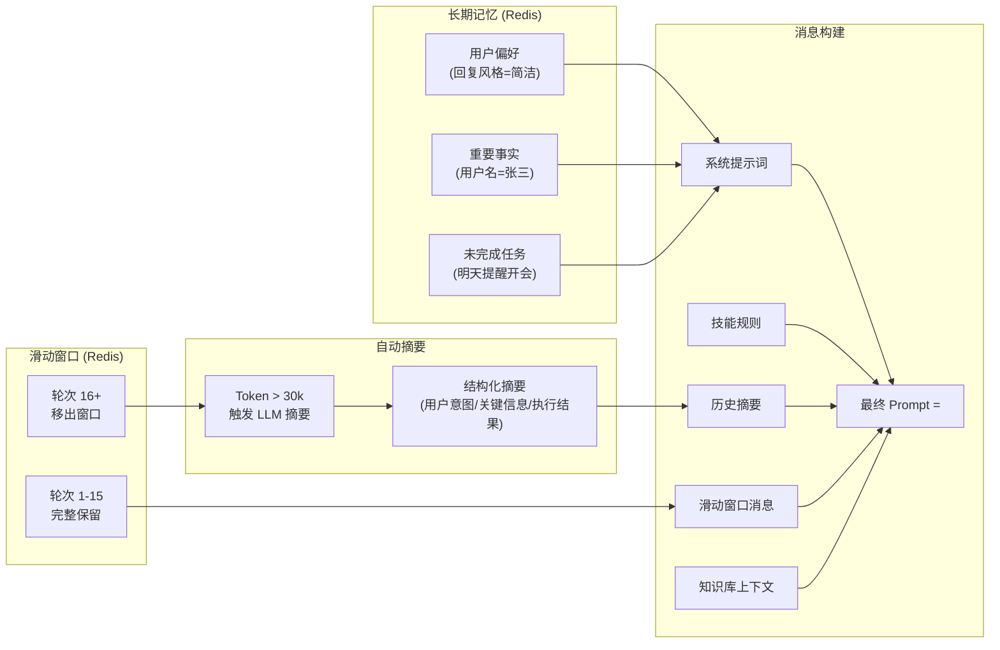
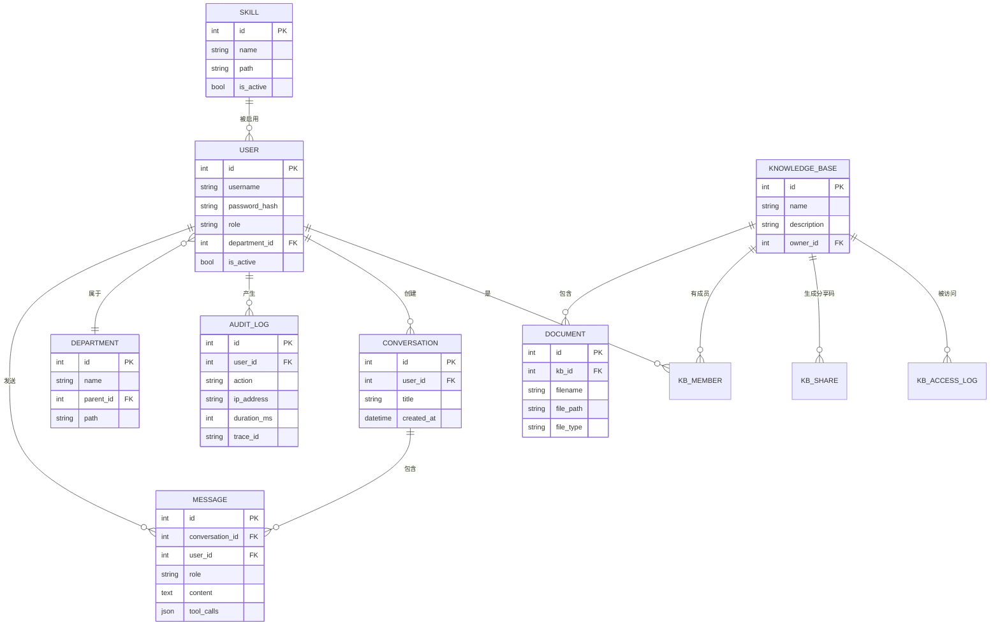
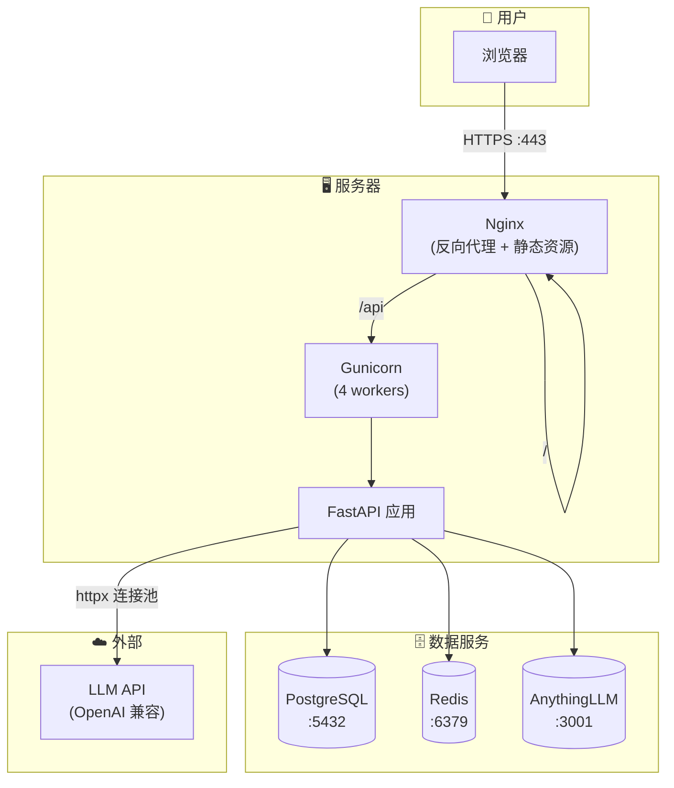

# LLM Agent Framework 架构图

## 系统整体架构



## Agent ReAct 循环流程



## 工具调用详细流程

```mermaid
sequenceDiagram
    participant U as 用户
    participant A as Agent 引擎
    participant TR as 工具注册表
    participant T1 as 文件工具
    participant T2 as 网络工具
    participant T3 as 知识库工具
    participant L as LLM

    U->>A: "帮我查天气并整理成文件"
    A->>L: 发送消息 (含工具列表 Schema)
    L-->>A: &lt;function_calls&gt;<br/>[get_weather, create_file]
    A->>TR: 获取工具函数快照
    par 并行执行
        A->>T1: create_file()
        A->>T2: get_weather()
    end
    T2-->>A: 天气数据
    T1-->>A: 文件创建成功
    A->>L: 注入工具结果，继续推理
    L-->>A: 最终回复文本
    A->>U: SSE 流式输出
```

## 上下文压缩与记忆系统



## 数据模型概览



## 部署架构


